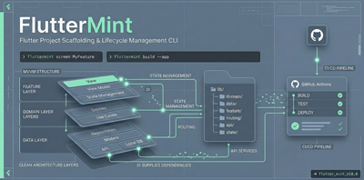

# FlutterForge

> A CLI tool that generates production-ready Flutter projects with pre-configured architecture, modules, and CI/CD pipelines.

<p align="center">
  
</p>

## What is FlutterForge?

FlutterForge scaffolds Flutter projects with a clean, opinionated architecture out of the box. Instead of spending hours wiring up state management, dependency injection, routing, theming, API layers, and CI/CD pipelines, you run a single command and get a project that's ready for feature development.

It generates projects following **MVVM + Clean Architecture** with **Provider** for state management and **GetIt** for dependency injection. Every generated file follows consistent patterns — base view models, repository interfaces, use case layers, and feature-based folder structure.

Beyond initial scaffolding, FlutterForge manages the project lifecycle. You can add or remove modules after creation, and shared files (`main.dart`, `app.dart`, `locator.dart`) are automatically recomposed to reflect the current module set. The CI/CD wizard generates GitHub Actions workflows with deployment to Firebase App Distribution, Google Play Store, and Apple TestFlight.

### Key Capabilities

- **Interactive wizard** — guided project setup with module selection and organization/package name configuration
- **12 modules** — MVVM, logging, service locator, theming, routing, API client, AI service, localization, startup flow, toast notifications, testing, and CI/CD
- **Screen generator** — `flutterforge screen <name>` scaffolds a complete MVVM screen with auto-injection into locator and router, optional route parameters, and test generation
- **Module lifecycle** — add and remove modules post-creation with automatic dependency resolution
- **CI/CD generator** — GitHub Actions with per-branch builds, Firebase distribution, Google Play upload, TestFlight deployment, auto-publish with release notes
- **Clean architecture** — domain/data/feature layers with repositories, use cases, and view models

## Installation

```bash
# Clone the repository
git clone https://github.com/<owner>/FlutterForge.git
cd FlutterForge

# Install dependencies
dart pub get

# Run directly
dart bin/flutterforge.dart create

# Or activate globally
dart pub global activate --source path .
flutterforge create
```

**Requirements:** Dart SDK ^3.0.0, Flutter SDK on PATH.

## Usage

### Create a project

```bash
# Interactive wizard — prompts for app name, organization, and modules
flutterforge create

# Quick create with defaults (MVVM + Logging)
flutterforge create my_app
```

The wizard asks for:
1. **App name** — lowercase with underscores (e.g. `my_app`)
2. **Organization** — reverse domain notation (e.g. `com.mycompany`)
3. **Optional modules** — yes/no for each available module

### Manage modules

```bash
# Add a module to an existing project
flutterforge add routing

# Remove a module
flutterforge remove theming

# See what's installed
flutterforge status
```

Adding or removing a module automatically updates `pubspec.yaml` and recomposes `main.dart`, `app.dart`, and `locator.dart`.

### Add a screen

```bash
# Generate a full MVVM screen (model, repository, usecase, viewmodel, view, tests)
flutterforge screen profile

# With route parameters
flutterforge screen profile --param id:String

# Multiple parameters (short form)
flutterforge screen product -p id:String -p category:String
```

This generates the complete feature stack and automatically:
- Injects dependencies into `locator.dart` (repository, usecase, viewmodel)
- Adds a `RoutePaths` constant and `GoRoute` to `app_router.dart`
- Creates unit and widget tests (if testing module is installed)
- Creates a screen-specific `widgets/` folder

### Enable HTTP connections

```bash
# Enable HTTP (non-HTTPS) on both Android and iOS
flutterforge enable-http

# Disable HTTP and revert to HTTPS only
flutterforge disable-http
```

- **Android:** adds/removes `android:usesCleartextTraffic="true"` in `AndroidManifest.xml`
- **iOS:** adds/removes `NSAppTransportSecurity` with `NSAllowsArbitraryLoads` in `Info.plist`

### Configure CI/CD

```bash
flutterforge config cicd
```

Opens an interactive wizard to configure:
- Branch triggers and build platforms (APK, AAB, Web, iOS)
- Format checking, caching, coverage, concurrency
- Firebase App Distribution
- Google Play Store upload (with track selection)
- TestFlight deployment (via separate macOS runner)
- Auto-publish mode with `whatsnew/` release notes

## Modules

| Module | Default | Description | Dependencies |
|--------|---------|-------------|--------------|
| **mvvm** | Yes | Base viewmodel, home feature scaffold, repository + use case layers | `provider ^6.1.0` |
| **logging** | Yes | Leveled `LoggerService` with info/warning/error methods | — |
| **locator** | No | GetIt service locator with auto-registration for all modules | `get_it ^8.0.0` |
| **theming** | No | Light/dark Material 3 themes with `ThemeProvider` toggle | — |
| **routing** | No | GoRouter with `RoutePaths` constants and `MaterialApp.router` integration | `go_router ^14.0.0` |
| **api** | No | Dio HTTP client with interceptors, exception handling, and auto-configured Android network permissions | `dio ^5.4.0` |
| **ai** | No | Generic AI service template for LLM/ML integration (auto-includes API module) | — |
| **localization** | No | ARB-based localization with English and Arabic starter files | `intl ^0.20.2` |
| **startup** | No | Splash/initialization flow with startup service and viewmodel | — |
| **toast** | No | Toast notifications via `ScaffoldMessenger` | — |
| **testing** | No | Unit and widget test examples with Mocktail mocks | `mocktail ^1.0.0` |
| **cicd** | No | GitHub Actions workflow with build, test, and deployment steps | — |

Module dependencies are resolved automatically. For example, enabling `theming` auto-includes `mvvm`, and enabling `ai` auto-includes `api`.

When the **API module** is included, `INTERNET` and `ACCESS_NETWORK_STATE` permissions are automatically added to `android/app/src/main/AndroidManifest.xml`.

## Generated Project Structure

```
my_app/
├── lib/
│   ├── app/
│   │   ├── app.dart                          # MaterialApp widget
│   │   ├── locator.dart                      # GetIt service registrations
│   │   └── startup/                          # Startup flow (if enabled)
│   ├── core/
│   │   ├── base/base_viewmodel.dart          # Base class for all viewmodels
│   │   ├── api/                              # Dio client + interceptors
│   │   ├── ai/                               # AI service template
│   │   ├── localization/arb/                 # ARB translation files
│   │   ├── routing/app_router.dart           # GoRouter config + RoutePaths
│   │   ├── services/
│   │   │   ├── logger_service.dart           # Logging
│   │   │   └── toast_service.dart            # Toast notifications
│   │   └── theme/
│   │       ├── app_theme.dart                # Light/dark themes
│   │       └── theme_provider.dart           # Theme switching
│   ├── data/repositories/                    # Repository implementations
│   ├── domain/
│   │   ├── repositories/                     # Repository interfaces
│   │   └── usecases/                         # Business logic
│   ├── features/
│   │   ├── common/widgets/                     # Shared widgets across screens
│   │   └── home/
│   │       ├── models/home_model.dart
│   │       ├── viewmodels/home_viewmodel.dart
│   │       ├── views/home_view.dart
│   │       └── widgets/                        # Screen-specific widgets
│   └── main.dart
├── test/
│   ├── features/home/                        # Example tests
│   └── helpers/test_helpers.dart              # Mocks and setup
├── .github/workflows/ci.yml                  # CI/CD pipeline
├── whatsnew/whatsnew-en-US                    # Release notes
├── .flutterforge.yaml                        # Project config
├── analysis_options.yaml
├── l10n.yaml                                 # Localization config
└── pubspec.yaml
```

Only directories and files for enabled modules are generated.

## CI/CD Pipeline

The `config cicd` wizard generates a GitHub Actions workflow with these configurable steps:

| Step | Description |
|------|-------------|
| **1. Format Check** | `dart format --set-exit-if-changed .` |
| **2. Caching** | Cache Flutter SDK and pub dependencies |
| **3. Coverage** | Upload `lcov.info` to Codecov (requires testing module) |
| **4. Concurrency** | Cancel in-progress runs on new push |
| **5. Build Platforms** | Per-branch platform selection (APK, AAB, Web, iOS) |
| **6. Firebase Distribution** | Upload APK/AAB to Firebase for testers |
| **7. Google Play Upload** | Upload AAB to Google Play (internal/alpha/beta/production) |
| **8. TestFlight Upload** | Build IPA on macOS and upload to TestFlight |

Deployments only trigger on `push` events. Pull requests run tests and analysis only.

When TestFlight is enabled, iOS builds run on a separate `macos-latest` job that depends on the main build passing first — keeping macOS runner costs contained.

Auto-publish mode reads release notes from `whatsnew/whatsnew-en-US` and passes them to both Firebase and Google Play.

## Configuration

Project configuration is stored in `.flutterforge.yaml`:

```yaml
app_name: my_app
org: com.mycompany
modules:
  - mvvm
  - logging
  - locator
  - theming
  - cicd
cicd:
  branches:
    - main
    - develop
  format_check: true
  caching: true
  coverage: false
  concurrency: true
  builds:
    main:
      - aab
      - ios
    develop:
      - apk
  deployment:
    firebase_distribution: true
    firebase_groups: testers
    google_play_upload: true
    google_play_track: internal
    package_name: com.mycompany.my_app
    auto_publish: false
    testflight_upload: true
    bundle_id: com.mycompany.my_app
```

## Technical Details

| | |
|---|---|
| **Language** | Dart |
| **Architecture** | MVVM + Clean Architecture |
| **State Management** | Provider (ChangeNotifier) |
| **Dependency Injection** | GetIt (service locator pattern) |
| **Routing** | GoRouter |
| **HTTP Client** | Dio with interceptors |
| **Testing** | Mocktail for mocking |
| **CI/CD** | GitHub Actions |
| **Localization** | Flutter intl with ARB files |
| **Min Flutter SDK** | ^3.0.0 |

### How Generation Works

1. **`flutter create --org <org> <app_name>`** — creates the base Flutter project
2. **Module resolution** — topological sort resolves dependency order
3. **Pubspec editing** — module dependencies are injected into `pubspec.yaml`
4. **File generation** — each module emits its files via `generateFiles()`
5. **Shared file composition** — `main.dart`, `app.dart`, and `locator.dart` are composed by collecting imports, setup lines, provider declarations, and service registrations from all active modules
6. **Platform configuration** — Android permissions are added to `AndroidManifest.xml` when the API module is included
7. **`flutter pub get`** — resolves the dependency tree
8. **Config persistence** — `.flutterforge.yaml` records the project state

### How Screen Generation Works

1. **Feature files** — model, repository (interface + impl), usecase, viewmodel, and view are generated under `lib/features/<name>/` and `lib/domain/`/`lib/data/`
2. **Locator injection** — imports and registrations are inserted into the existing `locator.dart` without rewriting it
3. **Router injection** — a `RoutePaths` constant and `GoRoute` are inserted into `app_router.dart` using marker comments
4. **Route parameters** — `--param id:String` generates parameterized routes (`/profile/:id`) with `state.pathParameters` extraction in the builder
5. **Test generation** — unit and widget tests are generated when the testing module is installed
6. **Widgets folder** — a screen-specific `widgets/` directory is created for local components

### CLI Dependencies

- **[args](https://pub.dev/packages/args)** — command and argument parsing
- **[path](https://pub.dev/packages/path)** — cross-platform path manipulation
- **[yaml](https://pub.dev/packages/yaml)** — YAML parsing for config files

## Roadmap

- [ ] Web deployment via Firebase Hosting
- [ ] Bitbucket Pipelines and GitLab CI templates
- [ ] Fastlane integration for iOS/Android signing
- [ ] Flavors/environments support (dev, staging, production)
- [ ] Custom module authoring (user-defined templates)
- [ ] `flutterforge upgrade` command to update module templates in existing projects
- [ ] `flutterforge doctor` command to validate project health
- [ ] Riverpod and Bloc as alternative state management options
- [ ] Supabase and Firebase backend module integration
- [ ] Windows, macOS, and Linux desktop platform support
- [ ] Plugin for VS Code and Android Studio
