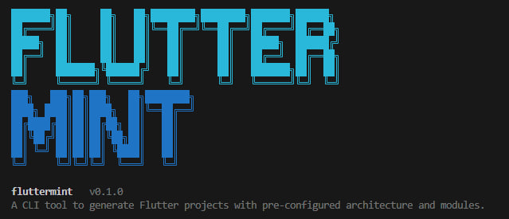

# FlutterMint

> A CLI tool that generates production-ready Flutter projects with pre-configured architecture, modules, and CI/CD pipelines.

<p align="center">
  
</p>
  
<p align="center">

</p>

## What is FlutterMint?

FlutterMint scaffolds Flutter projects with a clean, opinionated architecture out of the box. Instead of spending hours wiring up state management, dependency injection, routing, theming, API layers, and CI/CD pipelines, you run a single command and get a project that's ready for feature development.

Choose from **three architecture patterns**:

| Pattern | State Management | Dependency Injection |
|---------|-----------------|---------------------|
| **MVVM** | Provider + ChangeNotifier | GetIt (service locator) |
| **MVI** | BLoC + Equatable | GetIt (service locator) |
| **MVVM + Riverpod** | flutter_riverpod + AsyncNotifier | Riverpod providers (no GetIt) |

Every generated file follows consistent patterns — repository interfaces, use case layers, and feature-based folder structure. The domain layer (models, repositories, use cases) is shared across all patterns; only the presentation layer differs.

Beyond initial scaffolding, FlutterMint manages the project lifecycle. You can add or remove modules after creation, and shared files (`main.dart`, `app.dart`, `locator.dart`) are automatically recomposed to reflect the current module set. The CI/CD wizard generates GitHub Actions workflows with deployment to Firebase App Distribution, Google Play Store, and Apple TestFlight.

### Key Capabilities

- **Interactive wizard** — guided project setup with architecture pattern selection, module selection, and organization/package name configuration
- **3 architecture patterns** — MVVM (Provider), MVI (BLoC), and MVVM + Riverpod — choose during project creation
- **15 modules** — architecture patterns, logging, service locator, theming, routing, API client, AI service, localization, startup flow, toast notifications, testing, CI/CD, and flavors/environments
- **Screen generator** — `fluttermint screen <name>` scaffolds a complete screen (viewmodel/bloc/notifier + view + domain layer) with auto-injection into locator and router, optional route parameters, and test generation
- **Module lifecycle** — add and remove modules post-creation with automatic dependency resolution
- **CI/CD generator** — GitHub Actions with per-branch builds, Firebase distribution, Google Play upload, TestFlight deployment, auto-publish with release notes
- **Flavors / Environments** — compile-time environment config via `--dart-define-from-file` with per-environment JSON files and interactive config wizard
- **Run & Build commands** — `fluttermint run` and `fluttermint build` with interactive flavor, device, platform, and build mode selection
- **Multi-platform** — Android and iOS by default, with opt-in support for Web, macOS, Windows, and Linux
- **Clean architecture** — domain/data/feature layers with repositories, use cases, and pattern-specific presentation

## Installation

```bash
dart pub global activate fluttermint
```

Make sure the pub global bin directory is on your PATH:
- **Windows:** `%LOCALAPPDATA%\Pub\Cache\bin`
- **macOS/Linux:** `$HOME/.pub-cache/bin`

Then run:
```bash
fluttermint create
```

**Requirements:** Dart SDK ^3.0.0, Flutter SDK on PATH.

### VS Code Extension

FlutterMint also has a VS Code extension that provides a UI for all CLI commands.

Install it from the [VS Code Marketplace](https://marketplace.visualstudio.com/items?itemName=masoud-dalman.fluttermint) or search for **FlutterMint** in the Extensions tab.

## Usage

### Create a project

```bash
# Interactive wizard — prompts for app name, organization, and modules
fluttermint create

# Quick create with defaults (MVVM + Logging)
fluttermint create my_app
```

The wizard asks for:
1. **App name** — lowercase with underscores (e.g. `my_app`)
2. **Organization** — reverse domain notation (e.g. `com.mycompany`)
3. **Architecture pattern** — MVVM, MVI (BLoC), or MVVM + Riverpod
4. **Optional modules** — yes/no for each available module (filtered by chosen pattern)
5. **Platforms** — Android and iOS included by default; optionally enable Web, macOS, Windows, Linux

Quick create (`fluttermint create my_app`) prompts for architecture pattern, then uses default modules and platforms (Android + iOS).

### Manage platforms

```bash
# Show enabled and available platforms
fluttermint platform

# Interactively add platforms
fluttermint platform add

# Add specific platforms directly
fluttermint platform add web macos
```

Adding a platform runs `flutter create --platforms <platform> .` under the hood and updates `.fluttermint.yaml`.

### Manage modules

```bash
# Add a module to an existing project
fluttermint add routing

# Remove a module
fluttermint remove theming

# See what's installed
fluttermint status
```

Adding or removing a module automatically updates `pubspec.yaml` and recomposes `main.dart`, `app.dart`, and `locator.dart`.

### Add a screen

```bash
# Generate a full screen (model, repository, usecase, viewmodel/bloc/notifier, view, tests)
fluttermint screen profile

# With route parameters
fluttermint screen profile --param id:String

# Multiple parameters (short form)
fluttermint screen product -p id:String -p category:String
```

This generates the complete feature stack matching your chosen architecture pattern and automatically:
- Injects dependencies into `locator.dart` (MVVM/MVI) or generates provider declarations (Riverpod)
- Adds a `RoutePaths` constant and `GoRoute` to `app_router.dart`
- Creates unit and widget tests (if testing module is installed)
- Creates a screen-specific `widgets/` folder

### Enable HTTP connections

```bash
# Enable HTTP (non-HTTPS) on both Android and iOS
fluttermint enable-http

# Disable HTTP and revert to HTTPS only
fluttermint disable-http
```

- **Android:** adds/removes `android:usesCleartextTraffic="true"` in `AndroidManifest.xml`
- **iOS:** adds/removes `NSAppTransportSecurity` with `NSAllowsArbitraryLoads` in `Info.plist`

### Configure Flavors / Environments

```bash
# Add flavors module and configure environments
fluttermint config flavors
```

When configuring an existing project, an action menu lets you:
1. **Edit** a single environment without affecting others
2. **Add** a new environment
3. **Remove** an environment
4. **Reconfigure all** environments from scratch

Generated files:
- `config/dev.json`, `config/staging.json`, etc. — per-environment config values
- `lib/core/config/env_config.dart` — compile-time constants via `String.fromEnvironment()`

Run with a specific environment using `fluttermint run` (see below) or manually:
```bash
flutter run --dart-define-from-file=config/dev.json
flutter run --dart-define-from-file=config/production.json
```

### Run a project

```bash
fluttermint run
```

Interactive prompts guide you through:
1. **Environment** — select which flavor/environment to use (only if flavors module is installed)
2. **Device** — select from connected devices (auto-selects if only one device is detected)

Runs `flutter run` with the selected device and `--dart-define-from-file` for the chosen environment. Hot reload and all flutter output are passed through directly.

### Build a project

```bash
fluttermint build
```

Interactive prompts guide you through:
1. **Build mode** — debug or release (default: release)
2. **Environment** — select flavor (only if flavors module is installed)
3. **Platform** — APK, App Bundle (AAB), or iOS (.app)
4. **APK type** — fat APK or split per ABI (only for APK builds)

After a successful Android build, the output file is renamed to a descriptive format:
```
my_app-staging-release-v1.2.0.apk
my_app-production-release-v1.2.0.aab
my_app-dev-debug-v1.0.0-arm64-v8a.apk   (split per ABI)
```

**Android signing check:** When building a release APK or AAB without `android/key.properties`, a warning is shown explaining that debug keys are not suitable for Play Store distribution, with the option to continue or cancel.

**iOS builds:** After a successful `flutter build ios`, next steps are printed to guide you through Xcode for device testing or archiving for distribution.

### Configure CI/CD

```bash
fluttermint config cicd
```

Opens an interactive wizard to configure:
- Branch triggers and build platforms (APK, AAB, Web, iOS)
- Format checking, caching, coverage, concurrency
- Firebase App Distribution
- Google Play Store upload (with track selection)
- TestFlight deployment (via separate macOS runner)
- Auto-publish mode with `whatsnew/` release notes

## Modules

### Architecture Modules (pick one)

| Module | Description | Dependencies |
|--------|-------------|--------------|
| **mvvm** | Provider + ChangeNotifier — base viewmodel, home feature scaffold | `provider ^6.1.0` |
| **mvi** | BLoC + Equatable — base bloc/event/state, home feature scaffold | `flutter_bloc ^9.1.0`, `equatable ^2.0.0` |
| **riverpod** | flutter_riverpod + AsyncNotifier — home feature scaffold with providers | `flutter_riverpod ^2.6.1` |

### Optional Modules

| Module | Description | Dependencies |
|--------|-------------|--------------|
| **logging** | Leveled `LoggerService` with info/warning/error methods | — |
| **locator** | GetIt service locator with auto-registration (MVVM/MVI only) | `get_it ^8.0.0` |
| **theming** | Light/dark Material 3 themes with toggle | — |
| **routing** | GoRouter with `RoutePaths` constants and `MaterialApp.router` integration | `go_router ^14.0.0` |
| **api** | Dio HTTP client with interceptors, exception handling, and auto-configured Android network permissions | `dio ^5.4.0` |
| **ai** | Generic AI service template for LLM/ML integration (auto-includes API module) | — |
| **localization** | ARB-based localization with English and Arabic starter files | `intl ^0.20.2` |
| **startup** | Splash/initialization flow with pattern-appropriate startup logic | — |
| **toast** | Toast notifications via `ScaffoldMessenger` | — |
| **testing** | Unit and widget test examples with Mocktail mocks | `mocktail ^1.0.0` |
| **cicd** | GitHub Actions workflow with build, test, and deployment steps | — |
| **flavors** | Per-environment JSON configs with compile-time `EnvConfig` via `--dart-define-from-file` | — |

Module dependencies are resolved automatically. Modules incompatible with the chosen pattern are automatically excluded — for example, the **locator** module is hidden when using Riverpod (Riverpod providers replace GetIt).

When the **API module** is included, `INTERNET` and `ACCESS_NETWORK_STATE` permissions are automatically added to `android/app/src/main/AndroidManifest.xml`.

## Generated Project Structure

```
my_app/
├── lib/
│   ├── app/
│   │   ├── app.dart                          # MaterialApp widget
│   │   ├── locator.dart                      # GetIt registrations (MVVM/MVI)
│   │   └── startup/                          # Startup flow (if enabled)
│   ├── core/
│   │   ├── base/
│   │   │   ├── base_viewmodel.dart           # MVVM: ChangeNotifier base class
│   │   │   ├── base_state.dart               # MVI: Equatable base state
│   │   │   └── base_event.dart               # MVI: Equatable base event
│   │   ├── api/                              # Dio client + interceptors
│   │   ├── ai/                               # AI service template
│   │   ├── localization/arb/                 # ARB translation files
│   │   ├── routing/app_router.dart           # GoRouter config + RoutePaths
│   │   ├── config/
│   │   │   └── env_config.dart               # Compile-time env constants
│   │   ├── services/
│   │   │   ├── logger_service.dart           # Logging
│   │   │   └── toast_service.dart            # Toast notifications
│   │   └── theme/
│   │       ├── app_theme.dart                # Light/dark themes
│   │       ├── theme_provider.dart           # MVVM/MVI: ChangeNotifier toggle
│   │       └── theme_notifier.dart           # Riverpod: Notifier toggle
│   ├── data/repositories/                    # Repository implementations
│   ├── domain/
│   │   ├── repositories/                     # Repository interfaces
│   │   └── usecases/                         # Business logic
│   ├── features/
│   │   ├── common/widgets/                   # Shared widgets across screens
│   │   └── home/
│   │       ├── models/home_model.dart
│   │       ├── viewmodels/                   # MVVM: ChangeNotifier viewmodels
│   │       ├── bloc/                         # MVI: Bloc + Event + State
│   │       ├── notifiers/                    # Riverpod: AsyncNotifier classes
│   │       ├── providers/                    # Riverpod: Provider declarations
│   │       ├── views/home_view.dart
│   │       └── widgets/                      # Screen-specific widgets
│   └── main.dart
├── test/
│   ├── features/home/                        # Example tests
│   └── helpers/test_helpers.dart              # Mocks and setup
├── config/
│   ├── dev.json                              # Dev environment config
│   ├── staging.json                          # Staging environment config
│   └── production.json                       # Production environment config
├── .github/workflows/ci.yml                  # CI/CD pipeline
├── whatsnew/whatsnew-en-US                    # Release notes
├── .fluttermint.yaml                         # Project config
├── analysis_options.yaml
├── l10n.yaml                                 # Localization config
└── pubspec.yaml
```

Only directories and files for the chosen pattern and enabled modules are generated.

## CI/CD Pipeline

The `config cicd` wizard generates a GitHub Actions workflow with these configurable steps:

| Step | Description |
|------|-------------|
| **1. Format Check** | `dart format --set-exit-if-changed .` |
| **2. Caching** | Cache Flutter SDK and pub dependencies |
| **3. Coverage** | Upload `lcov.info` to Codecov (requires testing module) |
| **4. Concurrency** | Cancel in-progress runs on new push |
| **5. Build Platforms** | Per-branch platform selection (APK, AAB, Web, iOS) |
| **6. Firebase Distribution** | Upload APK/AAB to Firebase for testers |
| **7. Google Play Upload** | Upload AAB to Google Play (internal/alpha/beta/production) |
| **8. TestFlight Upload** | Build IPA on macOS and upload to TestFlight |

Deployments only trigger on `push` events. Pull requests run tests and analysis only.

When TestFlight is enabled, iOS builds run on a separate `macos-latest` job that depends on the main build passing first — keeping macOS runner costs contained.

Auto-publish mode reads release notes from `whatsnew/whatsnew-en-US` and passes them to both Firebase and Google Play.

## Configuration

Project configuration is stored in `.fluttermint.yaml`:

```yaml
app_name: my_app
org: com.mycompany
design_pattern: mvvm          # mvvm | mvi | riverpod
platforms:
  - android
  - ios
  - web
modules:
  - mvvm
  - logging
  - locator
  - theming
  - cicd
cicd:
  branches:
    - main
    - develop
  format_check: true
  caching: true
  coverage: false
  concurrency: true
  builds:
    main:
      - aab
      - ios
    develop:
      - apk
  deployment:
    firebase_distribution: true
    firebase_groups: testers
    google_play_upload: true
    google_play_track: internal
    package_name: com.mycompany.my_app
    auto_publish: false
    testflight_upload: true
    bundle_id: com.mycompany.my_app
flavors:
  default: production
  environments:
    - name: dev
      api_base_url: https://dev-api.example.com
      app_name_suffix: " Dev"
      app_id_suffix: .dev
    - name: staging
      api_base_url: https://staging-api.example.com
      app_name_suffix: " Staging"
      app_id_suffix: .staging
    - name: production
      api_base_url: https://api.example.com
```

## Technical Details

| | |
|---|---|
| **Language** | Dart |
| **Architecture** | Clean Architecture (domain/data/feature layers) |
| **Patterns** | MVVM (Provider), MVI (BLoC), MVVM + Riverpod |
| **State Management** | Provider, flutter_bloc, or flutter_riverpod |
| **Dependency Injection** | GetIt (MVVM/MVI) or Riverpod providers |
| **Routing** | GoRouter |
| **HTTP Client** | Dio with interceptors |
| **Testing** | Mocktail for mocking |
| **CI/CD** | GitHub Actions |
| **Localization** | Flutter intl with ARB files |
| **Min Flutter SDK** | ^3.0.0 |

### How Generation Works

1. **`flutter create --platforms <platforms> --org <org> <app_name>`** — creates the base Flutter project with selected platforms
2. **Module resolution** — topological sort resolves dependency order
3. **Pubspec editing** — module dependencies are injected into `pubspec.yaml`
4. **File generation** — each module emits its files via `generateFiles()`
5. **Shared file composition** — `main.dart`, `app.dart`, and `locator.dart` are composed by collecting imports, setup lines, provider declarations, and service registrations from all active modules
6. **Platform configuration** — Android permissions are added to `AndroidManifest.xml` when the API module is included; flavors inject dart-defines decoding into `build.gradle(.kts)` for native app name and package name suffixes
7. **`flutter pub get`** — resolves the dependency tree
8. **Config persistence** — `.fluttermint.yaml` records the project state

### How Screen Generation Works

1. **Feature files** — model, repository (interface + impl), usecase, and pattern-specific presentation files (viewmodel/bloc/notifier + view) are generated under `lib/features/<name>/` and `lib/domain/`/`lib/data/`
2. **Locator injection** (MVVM/MVI) — imports and registrations are inserted into the existing `locator.dart` without rewriting it
3. **Provider generation** (Riverpod) — a `providers/` file with repository, use case, and notifier providers is generated alongside the feature
4. **Router injection** — a `RoutePaths` constant and `GoRoute` are inserted into `app_router.dart` using marker comments
5. **Route parameters** — `--param id:String` generates parameterized routes (`/profile/:id`) with `state.pathParameters` extraction in the builder
6. **Test generation** — unit and widget tests matching the chosen pattern are generated when the testing module is installed
7. **Widgets folder** — a screen-specific `widgets/` directory is created for local components

### CLI Dependencies

- **[args](https://pub.dev/packages/args)** — command and argument parsing
- **[path](https://pub.dev/packages/path)** — cross-platform path manipulation
- **[yaml](https://pub.dev/packages/yaml)** — YAML parsing for config files

## Roadmap

- [ ] Web deployment via Firebase Hosting
- [ ] Bitbucket Pipelines and GitLab CI templates
- [ ] Fastlane integration for iOS/Android signing
- [x] Flavors/environments support (dev, staging, production)
- [ ] Custom module authoring (user-defined templates)
- [ ] `fluttermint upgrade` command to update module templates in existing projects
- [ ] `fluttermint doctor` command to validate project health
- [x] Riverpod and BLoC as alternative state management options
- [ ] Supabase and Firebase backend module integration
- [x] Windows, macOS, and Linux desktop platform support
- [x] Plugin for VS Code
- [ ] Plugin for Android Studio
